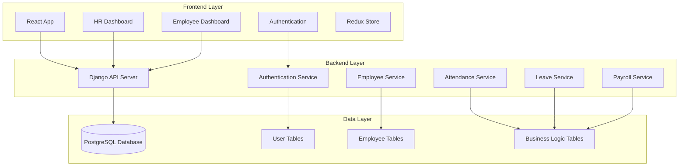

# System Architecture Diagram

## High-Level Architecture



## Component Architecture

### Frontend Components
```
src/
├── components/
│   ├── common/          # Reusable components
│   ├── layout/          # Layout components
│   ├── hr/             # HR-specific components
│   └── employee/       # Employee-specific components
├── pages/              # Page components
├── store/              # Redux store
├── services/           # API services
└── utils/              # Utility functions
```

### Backend Services
```
apps/
├── authentication/     # JWT auth, permissions
├── employees/         # Employee management
├── departments/       # Department management
├── attendance/        # Attendance tracking
├── leaves/           # Leave management
├── payroll/          # Payroll system
└── notifications/    # Notification system
```

## Data Flow

1. **Authentication Flow:**
   - User login → JWT token generation
   - Token-based API requests
   - Role-based access control

2. **CRUD Operations:**
   - Frontend forms → API calls → Database operations
   - Real-time updates via WebSocket (optional)

3. **File Uploads:**
   - Profile pictures, documents → Django media handling
   - Cloud storage integration (AWS S3/Cloudinary)

## Security Architecture

- JWT token authentication
- Role-based permissions (HR/Manager/Employee)
- CORS configuration
- Input validation and sanitization
- Rate limiting and throttling