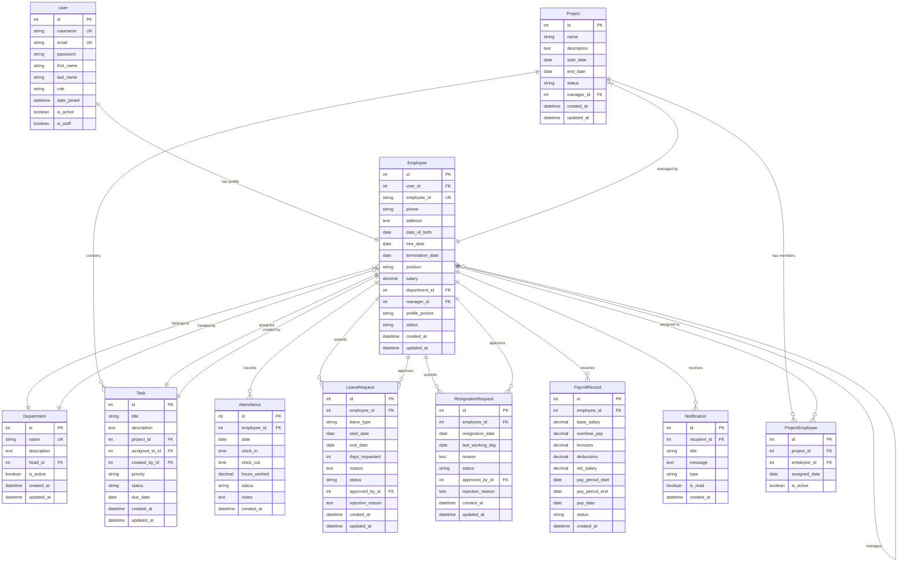

# Entity-Relationship Diagram (ERD)

## Database Schema Design



## Key Relationships

### User & Employee
- One-to-One relationship
- Employee extends User model with HR-specific fields
- User handles authentication, Employee handles business logic

### Department Structure
- Employees belong to departments
- Departments have heads (employees)
- Hierarchical structure support

### Project & Task Management
- Projects contain multiple tasks
- Projects have managers (employees)
- Many-to-many relationship between projects and employees
- Tasks assigned to specific employees

### Attendance System
- Daily attendance records per employee
- Clock-in/clock-out functionality
- Automatic hours calculation

### Leave & Resignation Management
- Employees submit requests
- HR/Managers approve/reject requests
- Status tracking and audit trail

### Payroll System
- Monthly/bi-weekly payroll records
- Salary calculations with overtime and deductions
- Payment history tracking

## Indexes and Performance

```sql
-- Key indexes for performance
CREATE INDEX idx_employee_user_id ON employees_employee(user_id);
CREATE INDEX idx_employee_department ON employees_employee(department_id);
CREATE INDEX idx_attendance_employee_date ON attendance_attendance(employee_id, date);
CREATE INDEX idx_task_assigned_to ON projects_task(assigned_to_id);
CREATE INDEX idx_leave_employee_status ON leaves_leaverequest(employee_id, status);
CREATE INDEX idx_notification_recipient ON notifications_notification(recipient_id, is_read);
```